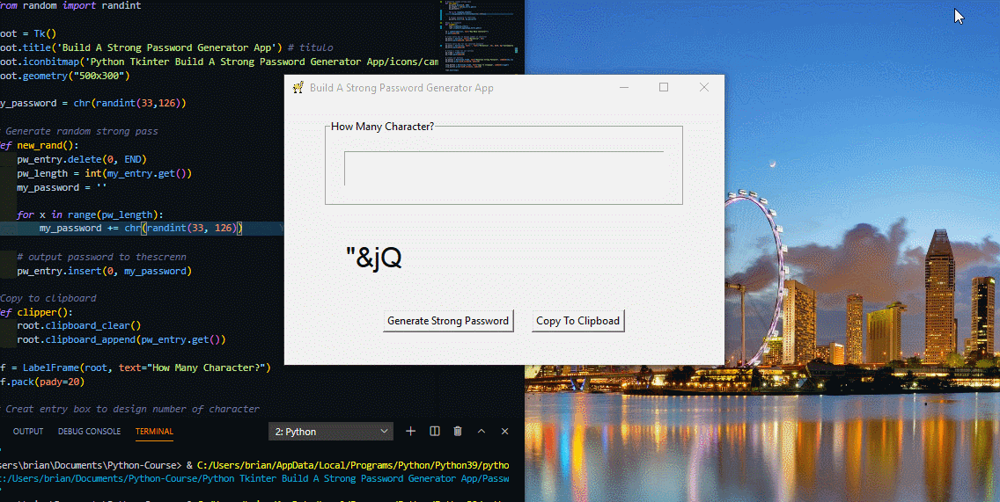

<h2 align="center">Build A Strong Password Generator App</h2>

  
  
  
  
     
   

  
<table align="center">
  <tr>
    <td align="center" style="padding=0;width=50%;">
      
    </td>
  </tr>
</table>
